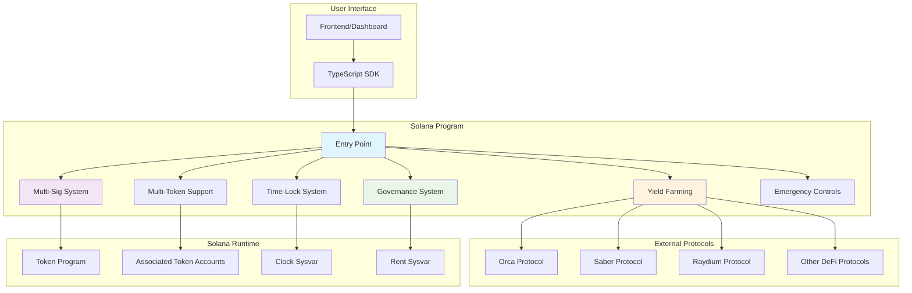

# 🔐 Advanced Solana Vault Program

A **production-ready, enterprise-grade** token vault program built in pure Rust for the Solana blockchain with advanced DeFi features including multi-signature support, time-locked withdrawals, yield farming integration, and decentralized governance.

## 📊 Architecture Overview

## ✨ Advanced Features

### 🔐 **Multi-Signature Security**
- Configurable threshold requirements (e.g., 3-of-5 signatures)
- Proposal-based transaction approval system
- Secure multi-authority management
- Signature collection and validation

### ⏰ **Time-Locked Withdrawals**
- **Cliff Vesting**: Tokens locked until specific date
- **Linear Vesting**: Gradual token release over time
- **Flexible Scheduling**: Customizable lock periods
- **Beneficiary Management**: Assign tokens to specific users

### 🚨 **Emergency Control System**
- **Circuit Breaker**: Pause all operations during emergencies
- **Emergency Admin**: Separate authority for emergency actions
- **Emergency Withdrawal**: Bypass normal restrictions if needed
- **Transparent Logging**: All emergency actions are recorded

### 🪙 **Multi-Token Support**
- Support for unlimited token types in single vault
- **Per-token Balance Tracking**: Individual balance management
- **Dynamic Token Addition**: Add new tokens without redeployment
- **Token Registry**: Maintain list of supported tokens

### 🌾 **Yield Farming Integration**
- **Strategy Management**: Configure yield farming strategies
- **Auto-Compounding**: Automatic reward reinvestment
- **Multi-Protocol Support**: Integrate with various DeFi protocols
- **Yield Harvesting**: Automated reward collection

### 🏛️ **Decentralized Governance**
- **Token-Based Voting**: Vote weight based on token holdings
- **Proposal System**: Community-driven decision making
- **Timelock Execution**: Secure delayed execution
- **Quorum Requirements**: Configurable voting thresholds

### 💰 **Advanced Fee Management**
- **Configurable Fees**: Deposit and withdrawal fees in basis points
- **Fee Collection**: Automated fee gathering and distribution
- **Dynamic Updates**: Governance-controlled fee adjustments
- **Fee Recipients**: Configurable fee collection addresses

### 📊 **Comprehensive Event System**
- **Real-time Monitoring**: All operations emit structured events
- **Transparent Tracking**: Complete audit trail of all activities
- **Integration Ready**: Events formatted for easy consumption
- **Performance Optimized**: Efficient event emission without gas overhead

## 🏗️ Enhanced Program Structure
