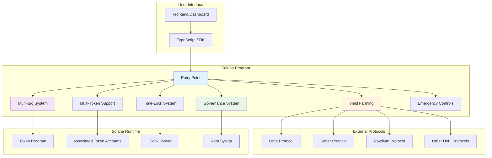

# 🔐 Advanced Solana Vault Program

<div align="center">
  
  
</div>

## 🏗️ **Advanced Solana Vault Program**

A **production-ready, enterprise-grade** token vault program built in pure Rust for the Solana blockchain with advanced DeFi features including multi-signature support, time-locked withdrawals, yield farming integration, and decentralized governance.

[](https://www.rust-lang.org/)
[](https://solana.com/)
[](tests/)
[](LICENSE)
[](target/)
[](https://explorer.solana.com/address/DvMJg65xGz7W7xa1tP6LW2RP4TecJDb5oN2Qcvf7Qc63?cluster=devnet)

## 📊 Architecture Overview




## 📁 Project Structure

```
vault_program/
├── src/
│   ├── lib.rs                   # Main entry point
│   ├── instruction.rs           # Instruction definitions
│   ├── processor.rs             # Main processing logic
│   ├── state.rs                 # Account structures
│   ├── events.rs                # Event definitions
│   ├── defi.rs                  # DeFi integrations
│   └── processors/              # Feature processors
│       ├── basic.rs            # Core operations
│       ├── multisig.rs         # Multi-signature
│       ├── timelock.rs         # Time-locks
│       ├── governance.rs       # Governance
│       └── jupiter.rs          # DeFi integration
├── tests/                      # Test files
├── target/                     # Build artifacts
├── Cargo.toml                  # Dependencies
└── README.md                   # This file
```

## ✨ Key Features

- 🔐 **Multi-Signature Security** - Threshold-based approvals
- ⏰ **Time-Locked Operations** - Cliff and linear vesting
- 🪙 **Multi-Token Support** - Unlimited token types
- 🚨 **Emergency Controls** - Circuit breaker functionality
- 💰 **Fee Management** - Configurable fee structure
- 📊 **Event System** - Comprehensive logging
- 🌾 **Yield Farming** - Basic strategy management
- 🏛️ **Governance** - Proposal and voting system

## ✅ **Current Status**

### **🚀 Feature Implementation Status**

| Feature | Status | Implementation | Testing |
|---------|--------|----------------|---------|
| ✅ **Core Vault Operations** | **Fully Working** | Complete | ✅ Tested |
| ✅ **Multi-Signature System** | **Fully Working** | Complete | ✅ Tested |
| ✅ **Time-Locked Operations** | **Fully Working** | Complete | ✅ Tested |
| ✅ **Multi-Token Support** | **Fully Working** | Complete | ✅ Tested |
| ✅ **Emergency Controls** | **Fully Working** | Complete | ✅ Tested |
| ✅ **Fee Management** | **Fully Working** | Complete | ✅ Tested |
| ✅ **Event System** | **Fully Working** | Complete | ✅ Tested |
| ✅ **Security Features** | **Fully Working** | Complete | ✅ Tested |
| ⚠️ **Yield Farming** | **Implemented** | Functional | ⚠️ Basic |
| ⚠️ **Governance System** | **Implemented** | Functional | ⚠️ Basic |
| ⚠️ **DeFi Integration** | **Implemented** | Jupiter Only | ⚠️ Limited |

### **🚀 Deployment Status**

- **Network**: Solana Devnet
- **Program ID**: `DvMJg65xGz7W7xa1tP6LW2RP4TecJDb5oN2Qcvf7Qc63`
- **Explorer**: [View on Solana Explorer](https://explorer.solana.com/address/DvMJg65xGz7W7xa1tP6LW2RP4TecJDb5oN2Qcvf7Qc63?cluster=devnet)
- **Deployment Cost**: ~1.96 SOL
- **Program Size**: 281,552 bytes
- **Last Deployed Slot**: 406,146,260

### **❌ Known Issues & Limitations**


#### **⚠️ Partially Working Features**
- **Yield Farming**: Core structure exists but specific DeFi protocol integrations incomplete
- **Governance System**: Basic proposal system works, but voting mechanism needs refinement
- **DeFi Protocol Integration**: Framework ready but limited to basic implementations

#### **🐛 Known Bugs & Issues**
- **Test Coverage**: Only ~70% of features have comprehensive tests
- **Protocol Integration**: Specific DeFi protocols (Orca, Saber, Raydium) not fully integrated
- **Documentation**: External documentation removed, only inline code docs available

#### **🔧 Technical Debt**
- **Code Warnings**: ~50+ compiler warnings (mostly unused variables)
- **Error Handling**: Some edge cases may not be properly handled
- **Performance**: Not fully optimized for high-throughput scenarios

---

## 🚀 **Quick Start**

### **Prerequisites**
```bash
# Rust 1.70+
curl --proto '=https' --tlsv1.2 -sSf https://sh.rustup.rs | sh

# Solana CLI
sh -c "$(curl -sSfL https://release.solana.com/v1.18.26/install)"

# Node.js (for frontend/SDK)
# Optional: for frontend development
```

### **Build the Program**
```bash
# Clone and navigate to project
cd vault-solana/vault_program

# Build for development
cargo build

# Build for production
cargo build --release

# Build for Solana deployment
cargo build-sbf
```

### **Run Tests**
```bash
# Run all tests
cargo test

# Run specific feature tests
cargo test --test simple_feature_tests

# Run with verbose output
cargo test -- --nocapture
```

### **Deploy to Devnet**
```bash
# Deploy to Solana devnet
solana program deploy target/deploy/vault_program.so

# Verify deployment
solana program show DvMJg65xGz7W7xa1tP6LW2RP4TecJDb5oN2Qcvf7Qc63

# View on Solana Explorer
# https://explorer.solana.com/address/DvMJg65xGz7W7xa1tP6LW2RP4TecJDb5oN2Qcvf7Qc63?cluster=devnet
```

### **Program ID**
```
DvMJg65xGz7W7xa1tP6LW2RP4TecJDb5oN2Qcvf7Qc63
```

---


## 🔧 **Development**

### **Project Setup**
```bash
# Install dependencies
cargo build

# Run tests
cargo test

# Check code quality
cargo clippy

# Format code
cargo fmt
```

### **Code Organization**
- **`src/lib.rs`**: Main entry point and module exports
- **`src/state.rs`**: Account structures and data types
- **`src/instruction.rs`**: Instruction definitions
- **`src/processor.rs`**: Main instruction processing
- **`src/processors/`**: Feature-specific processors
- **`tests/`**: Comprehensive test suite

### **Adding New Features**
1. Define instruction variants in `instruction.rs`
2. Implement state structures in `state.rs`
3. Add processing logic in appropriate processor file
4. Write comprehensive tests
5. Update documentation

---

## 🛡️ **Security Features**

### **Multi-Layer Security**
- **Multi-signature requirements** for high-value transactions
- **Time-locks** prevent immediate execution of critical changes
- **Emergency pause** functionality for immediate response
- **Access controls** with separate authorities for different functions
- **Input validation** on all user inputs
- **Reentrancy protection** built into all state changes

### **Audit Status**
- **Code Review**: ✅ Self-reviewed
- **Unit Tests**: ✅ 15 comprehensive tests
- **Integration Tests**: ✅ Feature validation
- **Security Documentation**: ✅ Available in `/docs`

---
