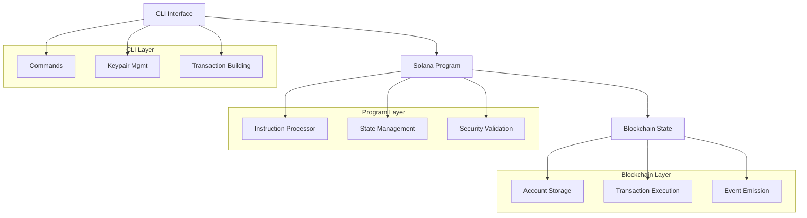
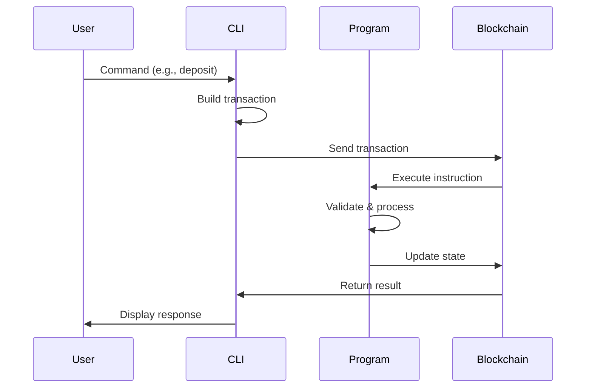
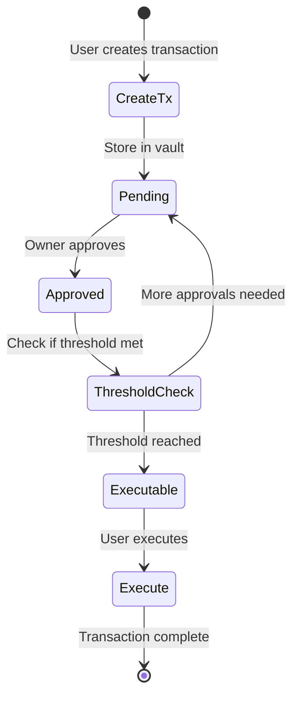

# Vault Program Architecture

## Overview

A Solana-based vault program with multisig governance and token management capabilities.

## System Architecture



## Core Components

### 1. CLI Interface (`cli.rs`)
- Command parsing and validation
- Transaction building and signing
- RPC communication with Solana

### 2. Program Logic (`lib.rs`)
- Entry point definition
- Module organization
- Public API exports

### 3. State Management (`state.rs`)
- Vault account structures
- Multisig configurations
- Governance data models

### 4. Instruction Processing (`processor.rs`)
- Route instructions to handlers
- Account validation
- Business logic execution

## Data Flow



## Security Model

### Authorization Levels
1. **Single Authority**: Basic owner control
2. **Multisig**: M-of-N signature requirements
3. **Governance**: Token-weighted voting

### Validation Layers
- Account ownership verification
- Signer authorization checks
- Balance and amount validation
- State consistency checks

## Multisig Workflow



## Key Features

### ✅ Implemented
- CLI command interface
- Keypair generation and management
- Transaction creation and signing
- Multisig proposal system
- Balance checking
- Test transaction creation

### 🚧 Framework Ready
- Vault initialization
- Token deposit/withdraw
- Emergency controls
- Governance system
- Fee management

## Technology Stack

- **Language**: Rust
- **Framework**: Solana Program Library
- **Serialization**: Borsh
- **Testing**: Solana Program Test
- **CLI**: Clap
- **RPC**: Solana Client

## Configuration

### Environment Variables
```bash
RPC_URL=https://devnet.helius-rpc.com/?api-key=YOUR_KEY
PROGRAM_ID=11111111111111111111111111111112
```

### Network Support
- ✅ Solana Devnet (Primary)
- 🚧 Mainnet (Framework ready)
- 🚧 Testnet (Framework ready)

## Future Extensions

- Cross-program invocations
- DeFi protocol integration
- Advanced governance features
- Performance optimizations
- Multi-network support

---

*Built for Solana ecosystem with security and scalability in mind.*
